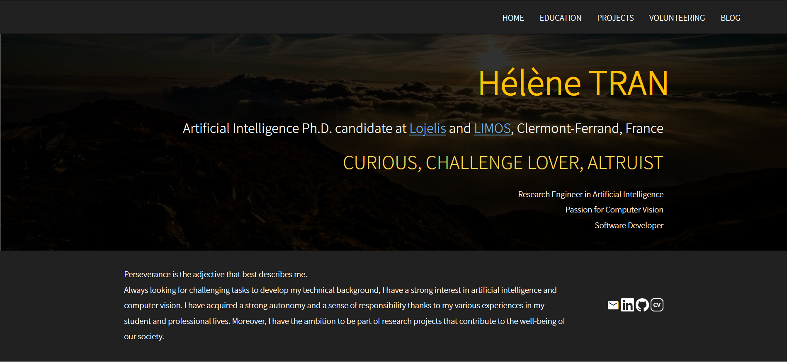
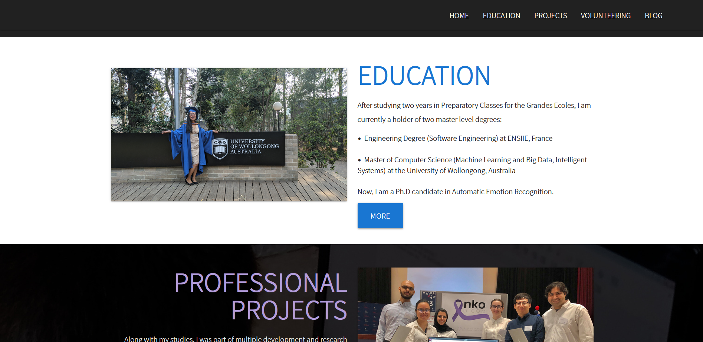
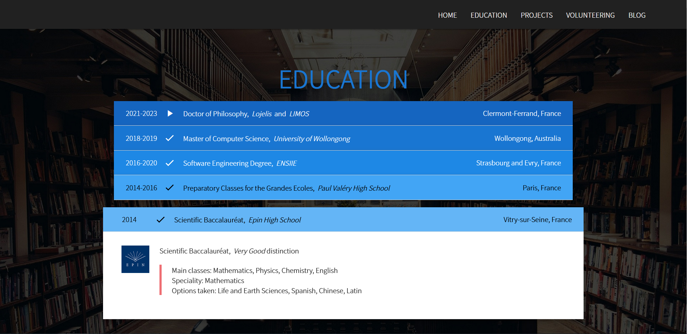
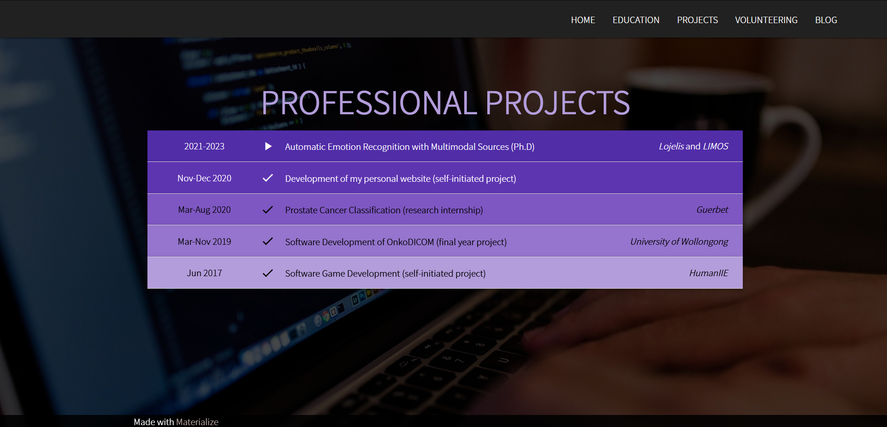

# Personal Website

A personal website built from scratch to learn and practise web development in **Django** (version 3.1.7). Made with **Materialize** template.

Run the following command from the root of the repository: 
`python3 manage.py runserver`.
This will display the http address where you can see the website.

#### Navigation Bar
1. Home
2. Education
2. Projects
2. Volunteering (*Not developed yet*)
2. Blog (*Not developed yet*)

### Home Page Structure

Composed of 6 sections:
1. **Presentation**: name, position title, three main soft skills and three technical skills
2. **Short presentation** along with 4 icons: email, LinkedIn profile, Github, and CV
3. **Education**: photo, short description and *More* button
4. **Professional Projects**: photo, short description and *More* button
5. **Volunteering**: photo, short description and *More* button
6. **Personal Blog section**: photo, short description and *More* button

**Home Page - Description**
 |-----------------------|
 

  
  

**Home Page - Education section** (*after scrolling the first screenshot*)
 |-----------------------|

  
  

**Education Page** (with one list item displayed)
 |-----------------------|
 

  
  

**Professional Project Page**
 |-----------------------|
 

  
  

